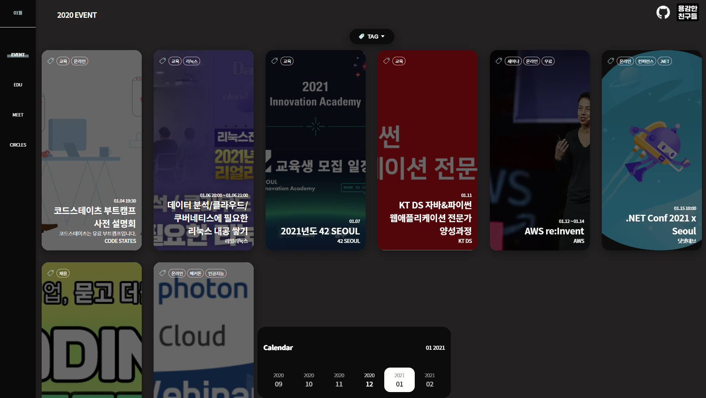

# Getting Started Dev-Event

 

🌐 Dev Event를 웹으로 만나요!!

------

# Link

- [Web Link](https://brave-people.github.io/Dev-Event-Client/)
- [Whale Store Link](https://store.whale.naver.com/detail/peoakdpkgaaddnccepdmgnjghelkdein)

------

# Update History

## v0.1.1
- 날짜별로 볼 수 있는 기능 & UI 추가
- month 관련 redux slice 생성
- 2021년 1월 데이터 추가

## v0.1.2
- 태그가 나오지 않던 버그 픽스

## v0.1.3
- 1월 데이터 나오지 않던 버그 픽스

 

------

# Developer

[@Woohwahwa](https://github.com/Woohwahwa)

[@Covenant](https://github.com/KoEonYack)