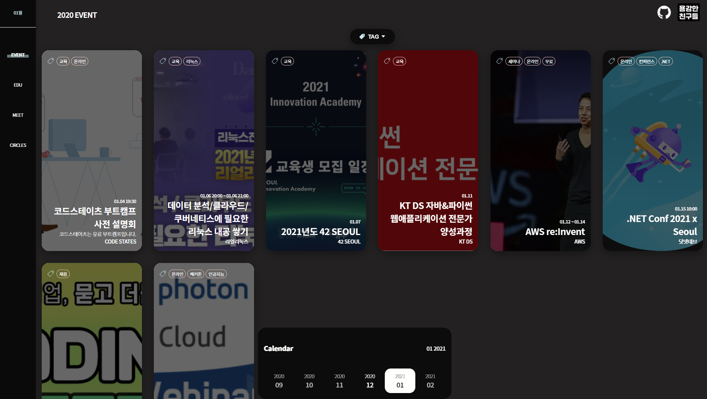

# Getting Started Dev-Event

 

🌐 Dev Event를 웹으로 만나요!!

------

# Link

- [Web Link](https://brave-people.github.io/Dev-Event-Client/)
- [Whale Store Link](https://store.whale.naver.com/detail/peoakdpkgaaddnccepdmgnjghelkdein)

------

# Update History

## v0.1.1
- 날짜별로 볼 수 있는 기능 & UI 추가
- month 관련 redux slice 생성
- 2021년 1월 데이터 추가

## v0.1.2
- 태그가 나오지 않던 버그 픽스

## v0.1.3
- 1월 데이터 나오지 않던 버그 픽스

## v0.2.0
- 과거 이벤트를 볼 수 있는 past event page 추가 
- 태그를 좀 더 쉽게 볼 수 있도록 event page 수정
- 이벤트 검색 기능 추가
- 이벤트 초성 검색 기능 추가

## v0.2.1
- pc에서 태그가 보이지 않던 현상 수정

## v0.2.2
- github link 추가

## v0.2.3 ~ v0.2.5
- 필요없는 코드 제거
- data.json 업데이트

## v0.2.10
- Event Page: 날짜와 시간 순으로 볼 수 있도록 로직 추가

 

-----

# 앞으로 할일
1. useMemo
2. useCallback
3. memo

------

# Developer

[@Woohwahwa](https://github.com/Woohwahwa)

[@Covenant](https://github.com/KoEonYack)
